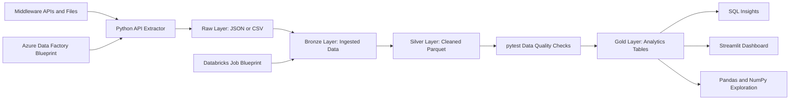

# Airline Digital Experience Data Platform

Portfolio data engineering project inspired by Lufthansa Group Digital Hangar and Middleware collaboration.

The goal is to build a small but production-minded data product: extract airline and travel-experience data from API-like sources, land it in a data lake, process it with PySpark, validate data quality with tests, expose SQL-ready analytical tables, and present insights in a dashboard.

## Why This Project

The project is designed around a Data Engineer role that combines data processing pipelines, dataset exploration, dashboards, API extraction, modern data architecture, Azure Data Factory, Databricks, and agile engineering practices.

Instead of presenting only a CV, this repository demonstrates how I would approach a real data product from scratch:

- define data contracts with a Middleware-facing mindset,
- build clean and testable Python/PySpark code,
- structure the pipeline as a bronze/silver/gold data lake,
- validate transformations with `pytest`,
- enforce code quality with `ruff`,
- prepare CI checks for review-ready development,
- show business value through notebooks, SQL, and a Streamlit dashboard.

For the full project story, see [Project Narrative](docs/project-narrative.md). For data expectations across the pipeline, see [Data Requirements](docs/data-requirements.md). For the technical design, see [Architecture](docs/architecture.md). For cloud mapping, see [Cloud Blueprint](docs/cloud-blueprint.md). For bronze processing details, see [Bronze Layer](docs/bronze-layer.md). For silver cleaning details, see [Silver Layer](docs/silver-layer.md). For business-ready tables, see [Gold Layer](docs/gold-layer.md). For exploratory analysis, see [Exploratory Analysis](docs/exploratory-analysis.md). For SQL examples, see [SQL Insights](docs/sql-insights.md). For dashboard usage, see [Streamlit Dashboard](docs/dashboard.md). For a short recruiter-facing version, see [Recruiter Summary](docs/recruiter-summary.md).

## 30-Second Review Path

If you are reviewing this project quickly:

1. Read the business scenario and target architecture below.
2. Check the completed data lake flow: raw -> bronze -> silver -> gold.
3. Open the SQL examples in `sql/`.
4. Review the Streamlit dashboard in `dashboard/app.py`.
5. Check the ADF and Databricks blueprints in `cloud/`.
6. Read the short [Recruiter Summary](docs/recruiter-summary.md) or the full [Demo Script](docs/demo-script.md).

## Business Scenario

Middleware exposes flight, airport, weather, and passenger-event data through APIs and operational files. Digital Hangar product teams need reliable insights to understand disruptions, punctuality, route performance, and the impact of operational events on the digital travel experience.

This platform turns raw operational signals into curated analytical data products that can support product owners, business analysts, data scientists, and engineering teams.

## Target Architecture



## Planned Stack

- Python, Pandas, NumPy
- PySpark
- SQL
- pytest
- Ruff
- Streamlit
- GitHub Actions
- Azure Data Factory blueprint
- Databricks job/notebook blueprint

## Repository Structure

```text
cloud/                  Azure Data Factory and Databricks blueprints
dashboard/              Streamlit dashboard
data/                   Local data lake folders
docs/                   Architecture, team context, ADRs, acceptance criteria
notebooks/              Exploratory analysis
scripts/                Local developer commands
sql/                    Analytical queries
src/airline_platform/   Python package
tests/                  Unit and data quality tests
```

## Development Commands

Python 3.14.4 is the latest stable CPython release at the time of writing, but
this project targets Python 3.12 for development and CI. The reason is pragmatic:
Databricks Runtime 16.4 LTS is powered by Apache Spark 3.5.2, so Python 3.12 with
PySpark 3.5.x is a safer portfolio target than Python 3.13 or 3.14. Azure Data
Factory is treated as an orchestrator for Databricks jobs, not as the Python
runtime owner.

```powershell
py -3.12 -m venv .venv
.\.venv\Scripts\Activate.ps1
python -m pip install -e ".[dev]"
ruff check .
ruff format .
PYTEST_DISABLE_PLUGIN_AUTOLOAD=1 pytest
airline-ingest-raw --output-dir data/raw
airline-build-bronze --raw-dir data/raw --output-dir data/bronze
airline-build-silver --bronze-dir data/bronze --output-dir data/silver
airline-build-gold --silver-dir data/silver --output-dir data/gold
streamlit run dashboard/app.py
airline-ingest-raw --airport-source ourairports --output-dir data/raw
airline-ingest-raw --airport-source ourairports --weather-source openmeteo --output-dir data/raw
```

On Windows PowerShell:

```powershell
.\scripts\run_checks.ps1
```

Run the first local ingestion step:

```powershell
airline-ingest-raw --output-dir data/raw
```

Build the bronze layer from validated raw files:

```powershell
airline-build-bronze --raw-dir data/raw --output-dir data/bronze
```

Build the silver layer from bronze datasets:

```powershell
airline-build-silver --bronze-dir data/bronze --output-dir data/silver
```

Build the gold layer from silver datasets:

```powershell
airline-build-gold --silver-dir data/silver --output-dir data/gold
```

Run the dashboard after building the gold layer:

```powershell
streamlit run dashboard/app.py
```

For live sharing, Streamlit Community Cloud, Render, Hugging Face Spaces, or Azure App Service are better fits than Netlify because this dashboard is a Python Streamlit app. Netlify is useful only for a static landing page that links back to this repository or to a hosted Streamlit app.

Streamlit Community Cloud settings:

- repository: `Explodingding/lufthansa`,
- branch: `cursor/day-1-foundation` until this work is merged,
- main file path: `dashboard/app.py`,
- Python runtime: `runtime.txt` pins Streamlit Cloud to Python 3.12.

The hosted dashboard falls back to embedded demo data with 720 representative flights when `data/gold` is not present. Local demos should still build the gold layer from the pipeline first.

Optionally use public airport metadata from OurAirports:

```powershell
airline-ingest-raw --airport-source ourairports --output-dir data/raw
```

Optionally enrich weather with Open-Meteo for airports that include coordinates:

```powershell
airline-ingest-raw --airport-source ourairports --weather-source openmeteo --output-dir data/raw
```

## Final Demo Flow

Use this flow when presenting the project to a recruiter or technical interviewer.

1. Start with the business story:
   - Middleware provides operational flight, airport, weather, and passenger-event signals.
   - Digital Hangar needs reliable data products for disruption, punctuality, and passenger communication insights.

2. Show the local data lake pipeline:

```powershell
airline-ingest-raw --output-dir data/raw
airline-build-bronze --raw-dir data/raw --output-dir data/bronze
airline-build-silver --bronze-dir data/bronze --output-dir data/silver
airline-build-gold --silver-dir data/silver --output-dir data/gold
```

3. Explain the layer responsibilities:
   - raw keeps source-shaped validated files,
   - bronze preserves source-aligned ingested datasets,
   - silver cleans, deduplicates, and derives operational fields,
   - gold prepares business-ready tables for SQL and dashboarding.

4. Open the exploratory analysis:
   - `notebooks/exploratory_analysis.ipynb`
   - Focus on missing values, duplicates, delay distribution, and business observations.

5. Review SQL insights:
   - `sql/route_delay_analysis.sql`
   - `sql/airport_disruption_ranking.sql`
   - `sql/passenger_communication_impact.sql`

6. Run the dashboard:

```powershell
streamlit run dashboard/app.py
```

7. Close with the cloud mapping:
   - ADF blueprint: `cloud/adf/pipeline-blueprint.json`
   - Databricks blueprint: `cloud/databricks/job-blueprint.json`
   - Runtime target: Databricks Runtime 16.4 LTS, Python 3.12, Spark/PySpark 3.5.2.

## Current Status

MVP implementation status:

- repository structure,
- project narrative,
- data contracts,
- clean code tooling,
- first tests and CI workflow,
- synthetic fallback raw ingestion,
- validation summary for raw sources,
- bronze Parquet build from raw JSON sources,
- silver cleaning with delay fields and deduplication,
- gold business tables for SQL and dashboard use,
- exploratory notebook with Pandas/NumPy data understanding,
- SQL insight queries over gold tables,
- Streamlit dashboard over gold tables,
- Azure Data Factory and Databricks cloud blueprints.

