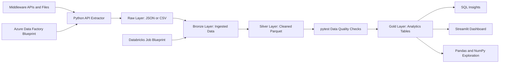

# Airline Digital Experience Data Platform

Portfolio data engineering project inspired by Lufthansa Group Digital Hangar and Middleware collaboration.

The goal is to build a small but production-minded data product: extract airline and travel-experience data from API-like sources, land it in a data lake, process it with PySpark, validate data quality with tests, expose SQL-ready analytical tables, and present insights in a dashboard.

## Why This Project

The project is designed around a Data Engineer role that combines data processing pipelines, dataset exploration, dashboards, API extraction, modern data architecture, Azure Data Factory, Databricks, and agile engineering practices.

Instead of presenting only a CV, this repository demonstrates how I would approach a real data product from scratch:

- define data contracts with a Middleware-facing mindset,
- build clean and testable Python/PySpark code,
- structure the pipeline as a bronze/silver/gold data lake,
- validate transformations with `pytest`,
- enforce code quality with `ruff`,
- prepare CI checks for review-ready development,
- show business value through notebooks, SQL, and a Streamlit dashboard.

For the full project story, see [Project Narrative](docs/project-narrative.md). For data expectations across the pipeline, see [Data Requirements](docs/data-requirements.md). For the technical design, see [Architecture](docs/architecture.md). For a short recruiter-facing version, see [Recruiter Summary](docs/recruiter-summary.md).

## Business Scenario

Middleware exposes flight, airport, weather, and passenger-event data through APIs and operational files. Digital Hangar product teams need reliable insights to understand disruptions, punctuality, route performance, and the impact of operational events on the digital travel experience.

This platform turns raw operational signals into curated analytical data products that can support product owners, business analysts, data scientists, and engineering teams.

## Target Architecture



## Planned Stack

- Python, Pandas, NumPy
- PySpark
- SQL
- pytest
- Ruff
- Streamlit
- GitHub Actions
- Azure Data Factory blueprint
- Databricks job/notebook blueprint

## Repository Structure

```text
cloud/                  Azure Data Factory and Databricks blueprints
dashboard/              Streamlit dashboard
data/                   Local data lake folders
docs/                   Architecture, team context, ADRs, acceptance criteria
notebooks/              Exploratory analysis
scripts/                Local developer commands
sql/                    Analytical queries
src/airline_platform/   Python package
tests/                  Unit and data quality tests
```

## Development Commands

Python 3.14.4 is the latest stable CPython release at the time of writing, but
this project targets Python 3.12 for development and CI. The reason is pragmatic:
Databricks Runtime 16.4 LTS is powered by Apache Spark 3.5.2, so Python 3.12 with
PySpark 3.5.x is a safer portfolio target than Python 3.13 or 3.14. Azure Data
Factory is treated as an orchestrator for Databricks jobs, not as the Python
runtime owner.

```bash
python -m pip install -e ".[dev]"
ruff check .
ruff format .
PYTEST_DISABLE_PLUGIN_AUTOLOAD=1 pytest
airline-ingest-raw --output-dir data/raw
airline-ingest-raw --airport-source ourairports --output-dir data/raw
airline-ingest-raw --airport-source ourairports --weather-source openmeteo --output-dir data/raw
```

On Windows PowerShell:

```powershell
.\scripts\run_checks.ps1
```

Run the first local ingestion step:

```powershell
airline-ingest-raw --output-dir data/raw
```

Optionally use public airport metadata from OurAirports:

```powershell
airline-ingest-raw --airport-source ourairports --output-dir data/raw
```

Optionally enrich weather with Open-Meteo for airports that include coordinates:

```powershell
airline-ingest-raw --airport-source ourairports --weather-source openmeteo --output-dir data/raw
```

## Current Status

Day 2 ingestion foundation is in progress:

- repository structure,
- project narrative,
- data contracts,
- clean code tooling,
- first tests and CI workflow,
- synthetic fallback raw ingestion,
- validation summary for raw sources.

