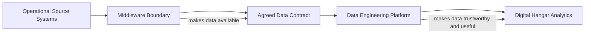
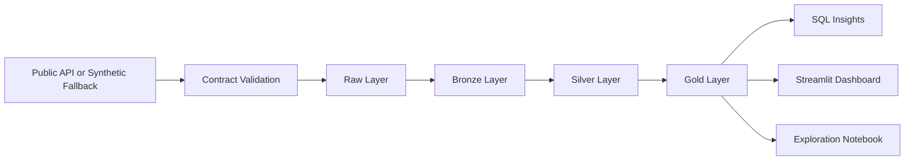

# Architecture

This document explains the architecture of the Airline Digital Experience Data Platform and the responsibility boundaries between Middleware, Data Engineering, and Digital Hangar consumers.

## Core Principle

The boundary between Middleware and Data Engineering is contract-based, not team-name-based.

In practice, this means the responsibility boundary is defined by:

- where data is made available,
- what contract describes the payload,
- who owns delivery reliability,
- who owns validation and analytical transformation,
- how errors are surfaced and handled.

The exact boundary can move depending on the organization. In a mature integration platform, Middleware may guarantee schemas, retries, delivery logs, and deduplication. In a smaller or less standardized environment, Data Engineering may need to implement more of those responsibilities close to ingestion.

For this project, the boundary is intentionally simple:

- Middleware makes data available through API-like payloads or files.
- Data Engineering validates, lands, cleans, models, tests, and publishes the data.
- Digital Hangar consumes trusted metrics, SQL outputs, notebooks, and dashboards.

## Responsibility Model

## Responsibility Split

### Middleware Responsibilities

Middleware is responsible for making operational data available reliably.

Typical responsibilities:

- expose or forward source-system data,
- provide API or file-based access,
- preserve source payload meaning,
- agree on schema contracts,
- communicate source changes,
- provide delivery status or integration logs where available.

In this project, Middleware is represented by:

- API-like source payloads,
- synthetic fallback data,
- source contracts,
- raw payload expectations.

### Data Engineering Responsibilities

Data Engineering is responsible for turning delivered data into trustworthy analytical data products.

Typical responsibilities:

- validate source contracts,
- preserve raw inputs,
- clean and standardize records,
- handle rejected records,
- transform data through raw, bronze, silver, and gold layers,
- create SQL-ready outputs,
- test data quality rules,
- document business definitions,
- provide dashboard-ready datasets.

In this project, Data Engineering is represented by:

- contract validation code,
- raw landing design,
- PySpark-oriented processing,
- pytest data quality tests,
- SQL insights,
- local data lake folders,
- CI checks.

### Digital Hangar Responsibilities

Digital Hangar consumes data products to improve digital travel experiences.

Typical responsibilities:

- define product questions,
- validate metric usefulness,
- interpret dashboard results,
- use insights for product decisions,
- collaborate with data engineers and analysts on new data needs.

In this project, Digital Hangar is represented by:

- disruption and punctuality metrics,
- passenger communication context,
- dashboard requirements,
- product-oriented acceptance criteria.

## Local Data Flow

## Data Lake Layers

### Raw Layer

Purpose:

- preserve source-aligned payloads,
- keep traceability,
- avoid destructive changes at ingestion time.

Expected content:

- original API or fallback records,
- source name,
- extraction timestamp,
- validation status or summary.

### Bronze Layer

Purpose:

- convert raw records into Spark-readable structured data,
- keep source-aligned fields,
- apply only minimal technical normalization.

Expected content:

- one dataset per source,
- explicit schema,
- parseable timestamps,
- consistent file format,
- minimal technical metadata such as bronze load timestamp and source file path.

The local bronze job reads validated raw JSON and writes Parquet datasets under `data/bronze/`. For details, see [Bronze Layer](bronze-layer.md).

### Silver Layer

Purpose:

- clean and standardize data,
- remove or mark duplicates,
- prepare reliable joins,
- expose data quality issues.

Expected content:

- cleaned flights,
- cleaned airports,
- cleaned weather observations,
- cleaned passenger events,
- derived delay fields,
- clear handling of cancelled or future flights.

The local silver job reads bronze Parquet datasets and writes cleaned Parquet datasets under `data/silver/`. For details, see [Silver Layer](silver-layer.md).

### Gold Layer

Purpose:

- provide business-ready datasets for SQL, dashboarding, and analysis.

Expected content:

- `gold_flight_performance`,
- `gold_route_performance`,
- `gold_airport_disruption`,
- `gold_passenger_communication`.

The local gold job reads silver Parquet datasets and writes business-ready Parquet tables under `data/gold/`. For details, see [Gold Layer](gold-layer.md).

## Cloud Mapping

The project runs locally first, but its shape maps to Azure Data Factory and Databricks.

### Azure Data Factory

ADF is treated as the orchestration layer.

Potential responsibilities:

- schedule or trigger ingestion,
- call API extraction or Databricks jobs,
- pass parameters,
- track pipeline runs,
- coordinate dependencies between steps.

ADF is not treated as the main Python runtime owner in this project.

### Databricks

Databricks is treated as the Spark processing layer.

Potential responsibilities:

- run PySpark jobs,
- process bronze, silver, and gold layers,
- store Delta or Parquet outputs,
- expose tables for SQL analytics,
- support notebooks for exploration.

The selected project target is Python 3.12 with PySpark 3.5.2, aligned with the Databricks Runtime 16.4 LTS reference.

The concrete cloud mapping is documented in [Cloud Blueprint](cloud-blueprint.md), with reviewable ADF and Databricks JSON artefacts under `cloud/`.

## Error Handling Approach

The MVP uses a simple error handling model:

- missing required fields produce human-readable validation errors,
- invalid controlled values are rejected before transformation,
- invalid timestamps are caught at the contract boundary,
- invalid airport codes and unrealistic weather values are surfaced early,
- future work may write rejected records to a quarantine location.

The goal is not to hide bad data. The goal is to make bad data visible before it reaches business metrics.

## MVP Limitations

The MVP intentionally does not include:

- real Lufthansa internal systems,
- production Azure deployment,
- streaming ingestion,
- personal passenger data,
- full observability stack,
- machine learning predictions.

These exclusions keep the scope focused on data engineering fundamentals: contracts, validation, processing, testing, SQL, and dashboard-ready outputs.