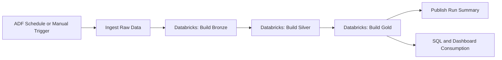

# Cloud Blueprint

This project runs locally first, but its structure maps directly to Azure Data Factory and Databricks.

The goal of this blueprint is not to deploy production infrastructure. It documents how the same pipeline would be orchestrated in a Lufthansa-style cloud environment.

## Artefacts

- `cloud/adf/pipeline-blueprint.json`
- `cloud/databricks/job-blueprint.json`

## Responsibility Split

### Azure Data Factory

ADF owns orchestration:

- schedule or trigger the pipeline,
- pass runtime parameters,
- call ingestion,
- trigger Databricks jobs,
- coordinate dependencies,
- retry failed orchestration steps,
- publish run status.

ADF is not treated as the main Python or Spark runtime.

### Databricks

Databricks owns Spark processing:

- build bronze datasets from raw data,
- clean and deduplicate silver datasets,
- create gold business tables,
- expose data for SQL, dashboarding, and notebooks,
- provide Spark task metrics and job run history.

The selected runtime target is Databricks Runtime 16.4 LTS, Python 3.12, and Spark/PySpark 3.5.2.

## Pipeline Flow



## Parameters

The blueprint uses parameters instead of hardcoded local paths:

- `environment`,
- `run_date`,
- `airport_source`,
- `weather_source`,
- `raw_path`,
- `bronze_path`,
- `silver_path`,
- `gold_path`.

Local paths such as `data/raw` map to cloud storage locations such as:

```text
abfss://airline-data@storage-account.dfs.core.windows.net/raw
abfss://airline-data@storage-account.dfs.core.windows.net/bronze
abfss://airline-data@storage-account.dfs.core.windows.net/silver
abfss://airline-data@storage-account.dfs.core.windows.net/gold
```

## Error Handling

The cloud blueprint keeps the same philosophy as the local project:

- reject invalid records before transformation,
- make validation summaries visible,
- retry external or orchestration failures,
- fail fast when a required layer is missing,
- keep build summaries as operational evidence.

ADF retries orchestration-level activities. Databricks retries Spark processing tasks. Data quality failures should remain visible rather than being silently ignored.

## Dev And Production Shape

The same logical flow can be promoted through environments:

- `dev`: synthetic or public API data, small clusters, manual runs,
- `test`: scheduled runs with stable test parameters,
- `prod`: production storage, managed identities, alerting, and stricter deployment approvals.

The MVP intentionally does not deploy these resources. The JSON files are reviewable blueprints that show how the local project would map to the cloud stack required in the role.

