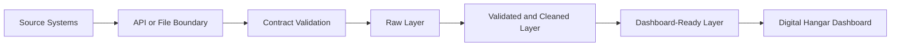

# Data Requirements

This document defines what data is expected at each point of the pipeline. It is written as a shared agreement between Middleware, Data Engineering, and Digital Hangar stakeholders.

## Data Flow Overview

## 1. API And Middleware Input Requirements

At this point, data is source-aligned. The goal is not to make it perfect yet. The goal is to receive it, validate the basic contract, and preserve the original payload.

### Flights

Required fields:

- `flight_id`: unique flight instance identifier.
- `flight_number`: public flight number, for example `LH001`.
- `origin_airport`: IATA airport code for departure airport.
- `destination_airport`: IATA airport code for arrival airport.
- `scheduled_departure_utc`: planned departure timestamp in UTC.
- `status`: operational status, for example `scheduled`, `departed`, `delayed`, `cancelled`.

Optional fields:

- `actual_departure_utc`: actual departure timestamp in UTC. It may be missing for future, scheduled, or cancelled flights.

Minimum rules:

- `flight_id` must not be empty.
- `origin_airport` and `destination_airport` should use three-letter IATA-style codes.
- timestamps should be parseable as UTC timestamps.
- `status` should belong to a known set of statuses.

Controlled values:

- `status`: `scheduled`, `departed`, `delayed`, `cancelled`.

### Airports

Required fields:

- `airport_code`: IATA airport code.
- `airport_name`: readable airport name.
- `city`: city served by the airport.
- `country`: country name or ISO country code, depending on source.

Optional fields:

- `timezone`: source-local timezone name.
- `latitude_deg`: airport latitude in decimal degrees.
- `longitude_deg`: airport longitude in decimal degrees.

Minimum rules:

- `airport_code` must be unique.
- `timezone` should be a valid timezone string.
- airport records should cover all airport codes referenced by flights.
- latitude and longitude, when available, should be within valid coordinate ranges.

### Weather

Required fields:

- `airport_code`: airport where the weather was observed.
- `observed_at_utc`: observation timestamp in UTC.
- `temperature_c`: temperature in Celsius.
- `wind_speed_kmh`: wind speed in kilometers per hour.
- `precipitation_mm`: precipitation in millimeters.

Public source:

- Open-Meteo historical weather API can provide hourly weather by airport coordinates.
- Public weather enrichment is optional; synthetic weather remains the deterministic fallback.

Minimum rules:

- weather records must reference known airport codes.
- observations should be close enough to flight times to be useful for analytics.
- numeric values should be within realistic ranges.

### Passenger Events

Required fields:

- `event_id`: unique passenger event identifier.
- `flight_id`: flight related to the event.
- `event_type`: event category, for example `mobile_check_in` or `delay_notification_sent`.
- `event_timestamp_utc`: event timestamp in UTC.
- `channel`: digital or service channel, for example `mobile_app`, `web`, `email`, or `sms`.

Minimum rules:

- `event_id` must be unique.
- `flight_id` should reference a known flight.
- `event_timestamp_utc` should not be after the pipeline processing timestamp.
- `event_type` and `channel` should belong to known controlled values.

Controlled values:

- `event_type`: `mobile_check_in`, `delay_notification_sent`, `boarding_pass_viewed`, `rebooking_offer_viewed`.
- `channel`: `mobile_app`, `web`, `email`, `sms`.

## 2. Requirements After Validation

After validation, the data should be safe enough to enter the data lake pipeline. It is still not fully business-clean, but it has passed basic expectations.

Required guarantees:

- all required fields are present,
- critical identifiers are not empty,
- timestamps are parseable,
- duplicate records are either removed or marked for review,
- records with invalid required fields are rejected or quarantined,
- raw payloads are preserved for traceability,
- validation errors are explicit and human-readable.

Expected outputs:

- accepted raw records written to the raw or bronze layer,
- rejected records written to a future quarantine location,
- validation summary with accepted and rejected record counts.

## 3. Requirements For The Cleaned Analytics Layer

The cleaned layer is where records become reliable enough for joins, SQL, dashboarding, and data science exploration.

### Flight-Level Requirements

The cleaned flight dataset should include:

- `flight_id`,
- `flight_number`,
- `origin_airport`,
- `destination_airport`,
- `scheduled_departure_utc`,
- `actual_departure_utc`,
- `status`,
- `departure_delay_minutes`,
- `is_delayed`,
- `is_cancelled`.

Business rules:

- `departure_delay_minutes` is calculated from actual vs scheduled departure.
- a flight is delayed when delay is greater than the selected business threshold.
- cancelled flights should not receive misleading departure delay values.

### Airport And Weather Join Requirements

The analytics layer should allow the pipeline to connect:

- flights to origin and destination airport metadata,
- flights to nearby weather observations at the origin airport,
- passenger events to their related flights.

Business rules:

- joins should not silently drop important flight records,
- missing enrichment data should be visible in quality metrics,
- dashboard metrics should use cleaned, not raw, records.

## 4. Dashboard Data Requirements

The dashboard is meant for a Digital Hangar-style product view. It should be transparent, simple, and focused on operational impact on digital travel experience.

Required dashboard metrics:

- total flights,
- delayed flights,
- cancelled flights,
- delay rate,
- average departure delay,
- top delayed routes,
- airports with highest disruption impact,
- passenger communication events around disruptions.

Required dashboard dimensions:

- date,
- origin airport,
- destination airport,
- route,
- flight status,
- event type,
- communication channel.

Required dashboard tables or views:

- `gold_flight_performance`: one row per flight with delay and status metrics.
- `gold_route_performance`: aggregated route-level punctuality and disruption metrics.
- `gold_airport_disruption`: airport-level disruption indicators.
- `gold_passenger_communication`: passenger event metrics connected to flight disruption context.

Transparency requirements:

- metric definitions must be documented,
- filters should be easy to understand,
- dashboard should show when data is synthetic or API-derived,
- dashboard should avoid presenting incomplete data as final truth.

## 5. Questions This Data Should Answer

The data model should support these questions:

- Which routes have the highest delay rate?
- Which airports contribute most to disruption impact?
- How often are delay notifications sent after a delay appears?
- Which communication channels are used around disruptions?
- How does weather correlate with departure delays?

## 6. What We Will Not Do In The MVP

To keep the project focused, the MVP will not include:

- real passenger personal data,
- PII processing,
- live production integrations,
- real Lufthansa internal systems,
- complex streaming architecture,
- ML predictions.

These are intentionally out of scope. The goal is to demonstrate data engineering delivery, not to imitate a full enterprise platform.